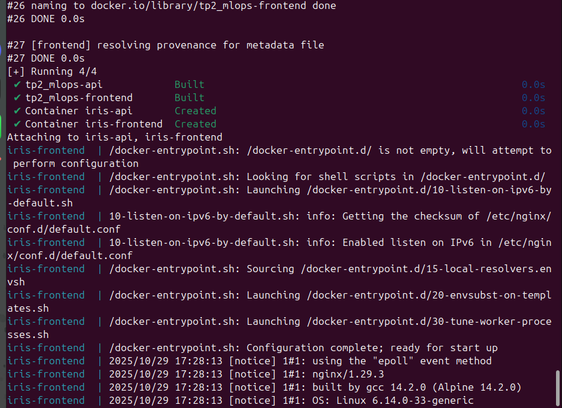

# Projet : API FastAPI + Frontend React (Docker / Docker Compose)

---

## Étapes de création des fichiers

### 1. Création de `api/Dockerfile`

Pour créer le Dockerfile pour l'API FastAPI, suivez ces étapes :

1. Créez un fichier nommé `Dockerfile` dans le dossier `api/`.
2. Utilisez l'image de base Python 3.11 slim pour une taille réduite.
3. Définissez le répertoire de travail à `/app`.
4. Copiez le fichier `requirements.txt` et installez les dépendances Python.
5. Copiez le dossier `app/` contenant le code de l'application.
6. Exposez le port 8000 pour l'API.
7. Définissez la commande de lancement avec uvicorn pour démarrer l'application.

Contenu du fichier `api/Dockerfile` :

```dockerfile
# Utiliser l'image Python 3.11 slim
FROM python:3.11-slim

# Définir le répertoire de travail
WORKDIR /app

# Copier les fichiers requirements
COPY requirements.txt .

# Installer les dépendances
RUN pip install --no-cache-dir -r requirements.txt

# Copier le code de l'application
COPY app/ ./app

# Exposer le port 8000
EXPOSE 8000

# Commande pour lancer l'application avec uvicorn
CMD ["uvicorn", "app.main:app", "--host", "0.0.0.0", "--port", "8000"]
```

### 2. Création de `frontend/Dockerfile`

Pour créer le Dockerfile pour le frontend React, suivez ces étapes :

1. Créez un fichier nommé `Dockerfile` dans le dossier `frontend/`.
2. Utilisez une approche multi-étapes : une pour le build et une pour servir.
3. Étape 1 : Utilisez `node:20-alpine` pour installer les dépendances et construire l'application.
4. Copiez `package.json` et `package-lock.json`, puis exécutez `npm install`.
5. Copiez le reste du code et exécutez `npm run build` pour générer le dossier `dist`.
6. Étape 2 : Utilisez `nginx:alpine` pour servir les fichiers statiques.
7. Copiez le dossier `dist` vers `/usr/share/nginx/html`.
8. Exposez le port 80.

Contenu du fichier `frontend/Dockerfile` :

```dockerfile
# Étape 1 : Build React
FROM node:20-alpine AS build

WORKDIR /app

COPY package*.json ./
RUN npm install

COPY . .
RUN npm run build

# Étape 2 : Nginx
FROM nginx:alpine

# Copier le build depuis dist
COPY --from=build /app/dist /usr/share/nginx/html

EXPOSE 80
CMD ["nginx", "-g", "daemon off;"]
```

### 3. Création de `docker-compose.yml`

Pour créer le fichier docker-compose.yml à la racine du projet, suivez ces étapes :

1. Utilisez la version 3.8 de Docker Compose.
2. Définissez deux services : `api` et `frontend`.
3. Pour le service `api` :
   - Build depuis le contexte `./api` avec le Dockerfile.
   - Nommez le conteneur `iris-api`.
   - Mappez le port 8000.
   - Définissez les variables d'environnement pour le port API et CORS.
   - Connectez au réseau `iris-network`.
   - Redémarrage automatique sauf si arrêté manuellement.
4. Pour le service `frontend` :
   - Build depuis le contexte `./frontend` avec le Dockerfile.
   - Nommez le conteneur `iris-frontend`.
   - Mappez le port 5174 vers 80 interne.
   - Définissez la variable d'environnement pour l'URL de base de l'API.
   - Dépend du service `api`.
   - Connectez au réseau `iris-network`.
   - Redémarrage automatique sauf si arrêté manuellement.
5. Définissez le réseau `iris-network` avec le driver bridge.

Contenu du fichier `docker-compose.yml` :

```yaml
version: '3.8'

services:
  api:
    build:
      context: ./api
      dockerfile: Dockerfile
    container_name: iris-api
    ports:
      - "8000:8000"
    environment:
      - API_PORT=8000
      - CORS_ORIGINS=http://localhost:5174
    networks:
      - iris-network
    restart: unless-stopped

  frontend:
    build:
      context: ./frontend
      dockerfile: Dockerfile
    container_name: iris-frontend
    ports:
      - "5174:80"
    environment:
      - VITE_API_BASE=http://localhost:8000
    depends_on:
      - api
    networks:
      - iris-network
    restart: unless-stopped

networks:
  iris-network:
    driver: bridge
```

## Capture d'écran des conteneurs en cours d'exécution

Après avoir créé les fichiers ci-dessus et exécuté `docker compose up --build`, voici une capture d'écran montrant les deux conteneurs en cours d'exécution :



---
